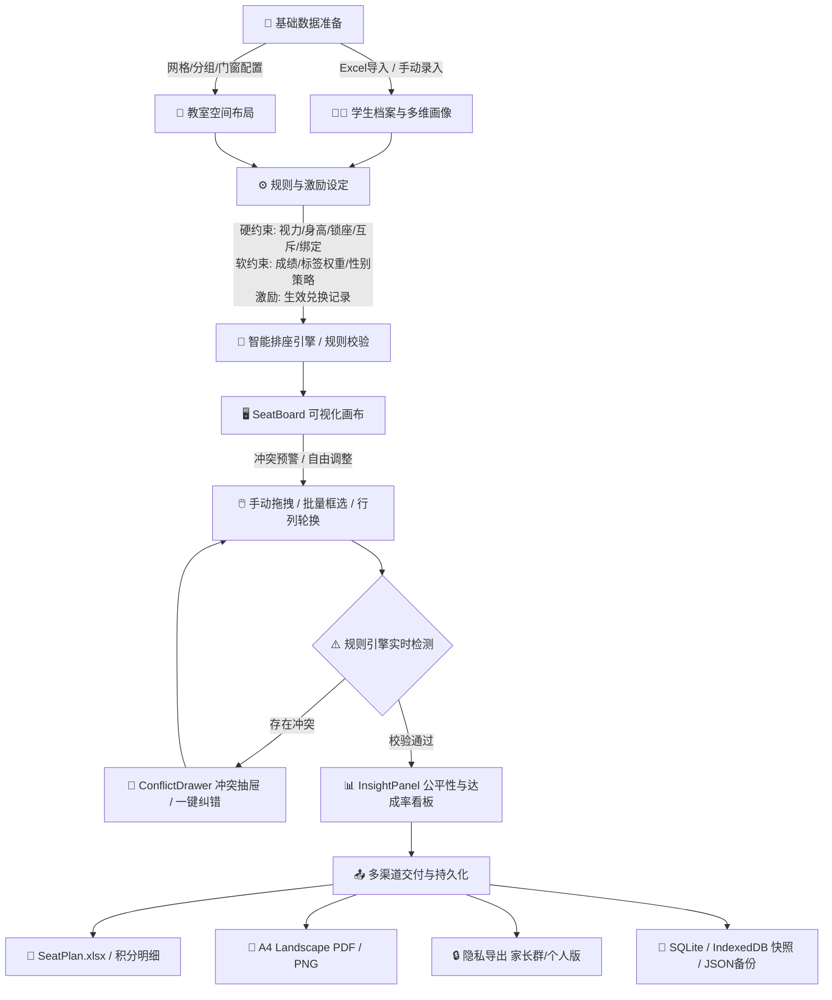

# 🎓 智能班级座位管理系统 (Smart Seat) - 开发设计文档

**版本**: v0.1.0 (完整功能就绪版)  
**更新日期**: 2026-08-20  
**状态**: 🟢 核心功能闭环已全部交付，支持桌面端与 Web 双运行环境  

---

## 0. ✅ 系统交付情况总览

| 模块/能力 | 状态 | 交付文件与核心功能 |
| :--- | :---: | :--- |
| **学生档案与多维画像** | ✅ | Excel 批量导入/导出、标签与关键词联合检索、自定义字段管理、分组组长角色配置、学科成绩/自定义颜色/备注维护（`StudentPanel.tsx`、`StudentListPanel.tsx`、`AddStudentModal.tsx`、`BatchEditStudentModal.tsx`）。 |
| **教室布局与门窗空间** | ✅ | 行列动态配置、列分组/自定义自由分组/组内分小组、讲台对齐（居中/居左/居右）及侧边座位开关、四壁门窗可视化编辑与吸附（`ClassroomPanel.tsx`、`DoorWindowManager.tsx`、`WallSlot.tsx`）。 |
| **智能排座与规则引擎** | ✅ | 视力/身高硬约束、多规则评分贪心排座、性别策略（男女混坐/同性同桌/任意）、同桌绑定/互斥关系、临时锁座（支持过期时间）、奖励权益生效联动、插件化可扩展规则校验（`services/seatEngine.ts`、`services/rules/RuleEngine.ts`）。 |
| **交互画布与视觉辅助** | ✅ | 基于 `@dnd-kit` 的单人/批量框选拖拽互换、行列轮换、讲台视角动态渲染、视力/成绩热力图、聚光灯搜索、显示样式微调（字号/展示项开关）（`SeatBoard.tsx`、`SeatTile.tsx`、`SeatBoardToolbar.tsx`、`DisplaySettingsModal.tsx`）。 |
| **冲突诊断与公平洞察** | ✅ | 视力/身高/互斥/绑定实时冲突抽屉定位、一键自动纠错、黄金区域占比、规则达成率统计、班级性别与标签分布看板（`ConflictDrawer.tsx`、`InsightPanel.tsx`）。 |
| **考试与成绩画像管理** | ✅ | 考试创建/编辑、多科目成绩录入与排名统计、均分/最高最低分/及格率看板（`ExamPanel.tsx`）。 |
| **积分激励与愿望商城** | ✅ | 积分流水记录（加减分/多场景原因）、积分排行榜、奖品商城 CRUD、愿望单绑定与兑换生命周期管理、排座优先权联动（`PointsDashboard.tsx`、`RewardPanel.tsx`、`PointsRankModal.tsx`、`BatchPointsModal.tsx`、`pointsExporter.ts`）。 |
| **课表与多方案排座** | ✅ | 周课表（1-7天、1-8节）拖拽编排、多座位方案（日常/考试/小组）独立保存与一键快照切换（`SchedulePanel.tsx`、`ClassManagementPanel.tsx`）。 |
| **数据持久化与容灾备份** | ✅ | 统一存储适配层（桌面端 `tauri-plugin-sql` SQLite 与浏览器端 `idb` IndexedDB）、全量 JSON 快照备份与还原、系统重置、SeatPlan.xlsx、A4 横向 PDF 导出、普通/隐私 PNG 截图（`services/storage/`、`exporter.ts`、`pdfExport.ts`、`backupHelper.ts`、`SystemResetModal.tsx`）。 |
| **桌面端打包与跨平台** | ✅ | **Tauri 2.0 (Rust)** + Vite 7 架构，系统托盘与原生窗口集成（`src-tauri/`）。 |

### 0.1 已验证闭环
- **全流程业务闭环**：学生导入/创建 → 规则与空间配置 → 智能排座/拖拽微调 → 冲突校验 → 导出分享（Excel / PDF / PNG / JSON 备份）。
- **双引擎存储**：应用启动自动探测运行环境，Tauri 环境下读写 SQLite，Web 环境下无缝切换至 IndexedDB。
- **激励排座联动**：学生积分兑换“座位锁定”或“同桌优先”奖励后，排座引擎自动解析并在算法中优先满足约束。

### 0.2 后续演进规划
- 引入遗传算法 (Genetic Algorithm) / 模拟退火算法优化超大规模复杂约束的全局最优解。
- 自动化场景联动：周课表节次变更时自动提示切换对应的座位方案。
- AI 智能排座点评：接入 LLM API 输出排座合理解释与个性化家校沟通建议。

---

## 1. 🎯 核心业务流程 (Workflow)



---

## 2. 🧩 核心功能模块详解 (Feature Modules)

### 2.1 📂 档案与空间管理 (Data & Space)
- **学生画像**：支持姓名、学号、性别、身高、视力、综合评分、语文/数学/英语成绩、个性化标签、自定义字段（文本/数字/日期/单选/多选）、组长角色（班长/学科组长等）、专属座位标记、卡片自定义颜色及备注。
- **教室空间编辑器**：
  - 支持任意行数与列数动态设定。
  - 分组模式：无分组（`none`）、按列分组（`column`，支持自定义每组列宽 `groupSizes` 与组间距 `groupGap`）、自由分组（`custom`，按组分配指定座位格）。
  - 讲台配置：支持居左、居中、居右对齐，支持隐藏或显示讲台两侧座位。
  - 门窗系统：四壁（上/下/左/右）吸附式门、窗元素，可自由指定位置序号与类型。
- **多班级管理**：班级增删改查、年级归类、班级数据独立隔离存储。

### 2.2 ⚙️ 智能排座与规则引擎 (Core Engine)
系统采用「强约束优先 + 奖励兑换注入 + 贪心打分 + 性别策略 + 冲突后处理」的执行链路：

1. **约束注入与转换**：
   - 提取生效中的积分兑换记录：`seat_lock` 自动转为 `TemporaryLockRule`，`deskmate_priority` 自动转为 `bindingPairs`。
2. **硬性锁定分配**：
   - 优先保留学生自带的 `lockSeat` 固定座位。
   - 保留未过期的临时锁定规则（`temporaryLocks`）。
   - 为绑定对（`bindingPairs`）寻找相邻双人连座并锁定。
3. **优先级评分与筛选**：
   - 视力 $\le$ 视力阈值：强制限制在指定前排范围，赋予高优先级打分（+100分）。
   - 身高 $\le$ 身高阈值：强制限制在指定前排范围，赋予身高打分（+50分）。
   - 学霸标签与成绩梯度加权，确保前排与优劣搭配合理性。
4. **性别策略动态匹配**：
   - `mix`：同桌尽量男女搭配。
   - `separate`：同桌尽量同性别。
   - `any`：不限制性别。
5. **互斥后置拆分**：
   - 扫描所有互斥对（`mutexPairs`），若左右或前后相邻，自动触发非锁定学生的空位调换与冲突拆解。
6. **独立规则校验系统（`RuleEngine.ts`）**：
   - 面向对象插件化架构（`VisionRule`、`HeightRule`、`MutexRule`、`BindingRule`），供前端实时给出违规气泡与诊断建议。

### 2.3 🖥️ 可视化交互画布 (SeatBoard & Canvas)
- **拖拽排座**：基于 `@dnd-kit`，支持从左侧学生待分配列表直接拖拽入座、座位间双向互换、批量多选（Selection Mode）后整体平移。
- **空间与状态渲染**：
  - 讲台、讲台两侧座位、分组通道、四壁门窗实时呈现。
  - 座位卡片展示姓名、学号、性别、身高、视力、组长勋章、锁定标识、互斥/绑定标识、自定义背景色。
  - 样式自适应调节（`DisplaySettingsModal`）：可配置姓名/详情字号、学号/视力/身高字段显隐。
- **视图辅助**：
  - **热力图**：视力热力图、成绩热力图，直观审视教室资源分布。
  - **快捷工具**：整行左移/右移、整列前移/后移、行列整体顺时针轮换。
  - **全局缩放**：自适应窗口缩放（Auto Zoom）与 50%~150% 手动缩放滑块。

### 2.4 📝 考试与成绩管理 (Exam System)
- **考试维护**：支持创建期中、期末、月考等考试，配置考试日期、总分、科目列表及科目备注。
- **成绩录入与报表**：
  - 矩阵式录入全班各科目成绩，自动计算总分。
  - 统计看板：实时计算班级平均分、最高分、最低分、及格率（基于满分 60% 阈值）。

### 2.5 🎁 积分激励与愿望商城 (Points & Rewards)
- **积分账户与流水**：
  - 涵盖出勤（`attendance`）、纪律（`discipline`）、表现（`performance`）、作业（`homework`）、活动（`activity`）、手动调整（`manual`）、兑换消费（`redeem`）等场景。
  - 支持单人加减分与全班批量加减分（`BatchPointsModal`）。
  - 积分排行榜（`PointsRankModal`）与 Excel 完整流水导出（`pointsExporter.ts`）。
- **奖品商城与兑换生命周期**：
  - 奖品类型：指定座位锁定（`seat_lock`）、同桌优先权（`deskmate_priority`）、黄金区域偏好（`zone_preference`）、自定义奖品（`custom`）。
  - 兑换状态：`pending` $\to$ `active` $\to$ `used` / `expired` / `cancelled`，生效记录直接联动排座引擎。

### 2.6 📤 导出、快照与数据容灾 (Export & Storage)
- **Excel 导出**：导出标准 `SeatPlan.xlsx`（包含教室座位排布图与全班学生档案双工作表）以及积分流水表。
- **PDF 导出**：基于 `jspdf` 与 `html-to-image`，生成 A4 横向（297mm $\times$ 210mm）矢量/高清座位表文档，规避 Flex/Grid 换行挤压。
- **图片与隐私导出**：
  - 全量高清 PNG 截图。
  - 家长群隐私版（隐藏敏感字段）。
  - 个人专属高亮版（仅高亮指定学生，其余打码脱敏）。
- **方案管理与快照**：
  - 支持保存多套方案（如“常规教学”、“月考考场”、“小组讨论”），一键随时切换。
  - 完善的撤销/重做（Undo/Redo）历史动作栈。
  - 全局 JSON 数据备份与还原（`backupHelper.ts`）。
  - 系统危险操作安全重置机制（`SystemResetModal.tsx`）。

---

## 3. 🛠️ 技术架构选型 (Tech Stack)

| 层次 | 技术选型 | 版本/依赖 | 选型理由与架构角色 |
| :--- | :--- | :--- | :--- |
| **桌面运行时** | **Tauri 2.0** | `@tauri-apps/api ^2.10`, `cli ^2.10` | 极小体积（原生 WebView2），系统级托盘与本地硬件访问。 |
| **核心前端框架** | **React 18** | `react ^18.3.1`, `react-dom ^18.3.1` | 组件化 UI 驱动与高频状态响应。 |
| **开发与构建** | **Vite 7** + **TypeScript 5** | `vite ^7.2.2`, `typescript ~5.9.3` | 秒级 HMR 热更新，全局强类型安全。 |
| **状态管理** | **Zustand** | `zustand ^5.0.8` | 响应式轻量全局状态机，支持历史记录与持久化订阅。 |
| **UI 组件与图标** | **Ant Design** + **TailwindCSS** | `antd ^5.29.1`, `tailwindcss ^3.4.14` | 企业级后台组件体系与灵活的原子化 CSS。 |
| **拖拽交互** | **@dnd-kit** | `@dnd-kit/core ^6.3.1`, `sortable`, `modifiers` | 现代、无障碍、对触摸和鼠标手势友好的拖拽交互内核。 |
| **多源存储适配** | **SQLite** / **IndexedDB** | `@tauri-apps/plugin-sql ^2.4`, `idb ^8.0.3` | 原生 SQLite 与 Web 浏览器 IndexedDB 统一抽象接口。 |
| **文档与图表导出** | **XLSX** + **jsPDF** + **html-to-image** | `xlsx ^0.18.5`, `jspdf ^4.2.1`, `html-to-image ^1.11.13` | 客户端离线生成 Excel、A4 PDF 与高清脱敏图片。 |
| **时间处理** | **Day.js** | `dayjs ^1.11.19` | 轻量高效的时间计算与格式化工具。 |

---

## 4. 💾 数据模型设计 (Data Schema)

对应源码：[src/types/models.ts](file:///c:/Users/myself/Desktop/smartseat20260416/smartseat/smartseat-app/src/types/models.ts)

```typescript
// 1. 性别与愿望
export type Gender = 'male' | 'female';

export interface Wish {
  id: string;
  type: 'deskmate' | 'zone' | 'avoid';
  targetId: string;
  priority: number;
  isRedeemed: boolean;
}

// 2. 冲突类型与定义
export type ConflictType = 
  | 'no_adjacent'    // 不能相邻（上下左右）
  | 'no_left_right'   // 不能左右相邻
  | 'no_top_bottom'   // 不能上下相邻
  | 'stay_front'      // 需靠前
  | 'stay_back'       // 需靠后
  | 'avoid';          // 尽量不在同一区域

export interface StudentConflict {
  id: string;
  targetStudentId: string;
  conflictType: ConflictType;
  reason?: string;
}

// 3. 自定义字段
export interface CustomFieldDefinition {
  id: string;
  name: string;
  key: string;
  type: 'text' | 'number' | 'date' | 'select' | 'multiselect';
  required: boolean;
  options?: string[];
  defaultValue?: string | number;
  placeholder?: string;
  order: number;
}

// 4. 积分与奖励
export interface PointsLog {
  id: string;
  studentId: string;
  delta: number;
  reasonType: 'attendance' | 'discipline' | 'performance' | 'homework' | 'activity' | 'manual' | 'redeem' | 'other';
  reasonDetail: string;
  operator: string;
  createdAt: string;
}

export interface Reward {
  id: string;
  name: string;
  type: 'seat_lock' | 'deskmate_priority' | 'zone_preference' | 'custom';
  costPoints: number;
  payload: Record<string, any>;
  limitPerStudent?: number;
  isActive: boolean;
  description?: string;
  icon?: string;
  order: number;
}

export interface RewardRedeem {
  id: string;
  studentId: string;
  rewardId: string;
  status: 'pending' | 'active' | 'used' | 'expired' | 'cancelled';
  effectiveFrom: string;
  effectiveTo: string;
  linkedWishId?: string;
  createdAt: string;
  usedAt?: string;
  notes?: string;
}

// 5. 学生核心模型
export interface Student {
  id: string;
  name: string;
  studentNumber?: string;
  className?: string;
  gender: Gender;
  height: number;
  vision: number;
  score: string | number;
  tags: string[];
  lockSeat?: string;
  flexibleData: Record<string, string | number>;
  points: number;
  wishes: Wish[];
  remarks?: string;
  chineseScore?: string | number;
  mathScore?: string | number;
  englishScore?: string | number;
  conflicts?: StudentConflict[];
  customColor?: string;
  groupLeaderRoles?: string[]; // 如 ["班长", "语文组长"]
}

// 6. 教室与座位
export type SeatCellType = 'seat' | 'aisle' | 'stage' | 'void' | 'door' | 'window';

export interface SeatCell {
  id: string;
  row: number;
  col: number;
  type: SeatCellType;
  label?: string;
}

export interface DoorWindow {
  id: string;
  type: 'door' | 'window';
  position: 'left' | 'right' | 'top' | 'bottom';
  index: number;
}

export interface SeatGroup {
  id: string;
  name: string;
  seatIds: string[];
  color?: string;
}

export interface ClassroomConfig {
  rows: number;
  cols: number;
  cells: SeatCell[];
  groupMode?: 'none' | 'column' | 'custom';
  groupSize?: number;
  groupSizes?: number[];
  groupGap?: number;
  customGroups?: SeatGroup[];
  stageAlign?: 'left' | 'center' | 'right';
  showStageSideSeats?: boolean;
  subGroupRows?: number;
  doorsWindows: DoorWindow[];
}

export interface SeatAssignment {
  seatId: string;
  studentId: string | null;
}

export interface SeatLayoutScheme {
  id: string;
  name: string;
  classroom: ClassroomConfig;
  assignments: SeatAssignment[];
  createdAt: string;
  updatedAt: string;
}

// 7. 规则配置
export interface RelationPairRule {
  id: string;
  students: [string, string];
}

export interface TemporaryLockRule {
  id: string;
  studentId: string;
  seatId: string;
  expiresAt: string;
}

export interface SeatingRuleConfig {
  frontRowsForVision: number;
  visionThreshold: number;
  frontRowsForHeight: number;
  heightThreshold: number;
  genderPolicy: 'mix' | 'separate' | 'any';
  mutexPairs: RelationPairRule[];
  bindingPairs: RelationPairRule[];
  temporaryLocks: TemporaryLockRule[];
}

// 8. 考试与成绩
export interface Exam {
  id: string;
  name: string;
  date: string;
  subjects: string[];
  subjectDetails?: { [key: string]: { notes?: string } };
  totalScore?: number;
  description?: string;
  createdAt: string;
}

export interface ExamScore {
  id: string;
  examId: string;
  studentId: string;
  subject: string;
  score: number;
  rank?: number;
  notes?: string;
}

// 9. 课表与课程
export interface Course {
  id: string;
  name: string;
  teacher?: string;
  color?: string;
}

export interface ClassPeriod {
  id: string;
  dayOfWeek: number;   // 1-7
  periodIndex: number; // 1-8
  courseId: string;
}

export interface Schedule {
  periods: ClassPeriod[];
  periodNames?: string[];
  startTime?: string;
  endTime?: string;
}

// 10. 显示设置
export interface DisplaySettings {
  nameFontSize: number;
  detailsFontSize: number;
  showStudentNumber: boolean;
  showGenderHeight: boolean;
  showVision: boolean;
  seatLabelSize: number;
}
```

---

## 5. 🏗️ 系统目录与源码映射

```
smartseat-app/
├── index.html                               # 应用 HTML 模板
├── package.json                             # 依赖清单与运行指令
├── tsconfig.json / vite.config.ts           # TS 与 Vite 构建配置
├── tailwind.config.js / postcss.config.js   # 样式系统配置
├── src-tauri/                               # Tauri 桌面容器配置与 Rust 源码
│   ├── Cargo.toml / tauri.conf.json         # 桌面端包名、托盘、权限与窗口定义
│   └── src/ (main.rs, lib.rs)               # Tauri 启动入口与 SQL 插件注册
└── src/                                     # 前端应用核心源码
    ├── App.tsx                              # 顶级主视图（导航/视图切换/DND上下文）
    ├── main.tsx                             # React 挂载入口
    ├── components/
    │   ├── ClassSelector.tsx                # 班级快速切换与新建下拉
    │   ├── ErrorBoundary.tsx                # 全局渲染异常捕获
    │   ├── common/                          # 通用模态框（如 SystemResetModal）
    │   ├── seatmap/                         # 座位画布核心组件群
    │   │   ├── SeatBoard.tsx                # 排座交互画布主容器
    │   │   ├── SeatTile.tsx                 # 单个座位/讲台格卡片
    │   │   ├── SeatBoardToolbar.tsx         # 画布顶部操作栏（轮换/热力图/缩放）
    │   │   ├── DisplaySettingsModal.tsx     # 视觉呈现与字号控制
    │   │   ├── PrivacyExportModal.tsx       # 隐私与个人版导出配置
    │   │   ├── DoorWindowItem.tsx           # 门窗图元
    │   │   └── WallSlot.tsx                 # 四壁门窗吸附槽
    │   └── panels/                          # 业务控制面板群
    │       ├── StudentPanel.tsx             # 左侧学生名单与快速分配
    │       ├── StudentListPanel.tsx         # 学生全量档案与筛选画像
    │       ├── ClassroomPanel.tsx           # 教室规格/分组/讲台设置
    │       ├── RulePanel.tsx                # 视力/身高/互斥/绑定规则配置
    │       ├── ConflictDrawer.tsx           # 冲突诊断抽屉
    │       ├── InsightPanel.tsx             # 公平性与达成率分析看板
    │       ├── ExamPanel.tsx                # 考试创建与成绩统计
    │       ├── PointsDashboard.tsx          # 积分流水日志与明细
    │       ├── RewardPanel.tsx              # 奖励商城与兑换管理
    │       ├── PointsRankModal.tsx          # 积分排行榜
    │       ├── BatchPointsModal.tsx         # 批量积分加减弹窗
    │       ├── SchedulePanel.tsx            # 周课表拖拽编排
    │       ├── HistoryPanel.tsx             # 动作历史与撤销重做面板
    │       ├── ClassManagementPanel.tsx     # 班级多方案管理
    │       ├── CustomFieldsManager.tsx      # 自定义字段配置器
    │       ├── DoorWindowManager.tsx        # 门窗快速列表
    │       ├── AddStudentModal.tsx          # 新增学生弹窗
    │       └── BatchEditStudentModal.tsx    # 批量修改学生弹窗
    ├── hooks/
    │   ├── useKeyboardShortcuts.ts          # 全局快捷键（Ctrl+Z, Ctrl+Y, Ctrl+S等）
    │   └── useSeatOperations.ts             # 座位移动/轮换/批量操作逻辑封装
    ├── services/
    │   ├── seatEngine.ts                    # 智能排座算法引擎
    │   ├── rules/RuleEngine.ts              # 规则评估与违规诊断引擎
    │   ├── exporter.ts                      # Excel 与 PNG 导出服务
    │   ├── pointsExporter.ts                # 积分日志 Excel 导出
    │   └── storage/                         # 多环境统一持久化适配层
    │       ├── interface.ts                 # 存储接口规范
    │       ├── tauriProvider.ts             # SQLite 桌面端驱动
    │       ├── webProvider.ts               # IndexedDB 浏览器驱动
    │       └── index.ts                     # 存储适配单例工厂
    ├── store/
    │   └── useClassStore.ts                 # 核心状态仓库（Zustand 单一数据源）
    ├── types/
    │   ├── models.ts                        # 领域模型定义
    │   ├── ipc.ts                           # 进程通信模型
    │   └── global.d.ts                      # 全局环境声明
    └── utils/
        ├── backupHelper.ts                  # 全量 JSON 快照备份与导入
        ├── pdfExport.ts                     # A4 横版 PDF 高清导出
        ├── xlsx.ts                          # Excel 解析与数据转换
        ├── seatUtils.ts                     # 空间网格计算辅助
        └── historyHelper.ts                 # 状态快照与历史深度控制
```

---

## 6. 🚀 快速启动与调试指令

```bash
# 进入工程目录
cd smartseat/smartseat-app

# 1. 启动桌面端混合开发 (Tauri + Vite HMR)
npm run dev

# 2. 仅启动 Web 端快速预览 (浏览器调试)
npm run build:web
npm run preview

# 3. TypeScript 全量静态类型检查
npm run typecheck

# 4. 代码规范检查
npm run lint

# 5. 构建桌面端安装包 (.exe)
npm run build
```
